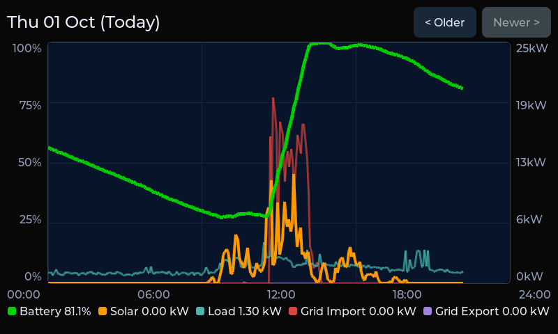
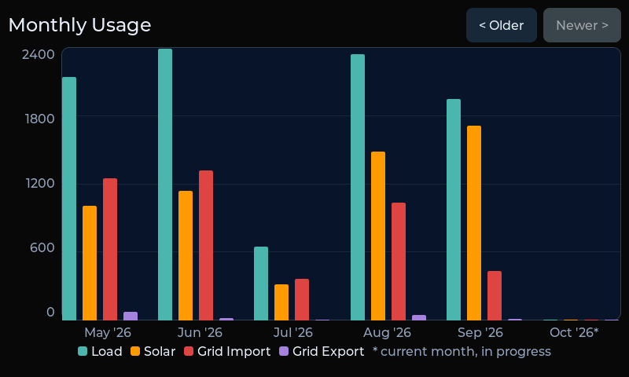

# Sigen dashboard on MicroPython

A touchscreen monitor for **Sigenergy SigenStor** solar/battery systems, running **MicroPython + LVGL 9** on the
[Waveshare ESP32-S3-Touch-LCD-7](https://www.waveshare.com/esp32-s3-touch-lcd-7.htm) (800x480). It polls the inverter over
Modbus TCP and shows live battery / solar / load / grid power, keeps 31 days of 5-minute history and 36 months of totals, and
serves a web page and JSON API.

This is the MicroPython sibling of [sigen-dashboard](https://github.com/mplinuxgeek/sigen-dashboard) (ESP-IDF / C). Same
features and HTTP API; the Python version keeps its code, heap and frame buffers in PSRAM, which leaves ~75 KB of internal SRAM
free (the C build ran down to a few KB).

| Dashboard | Graph | Monthly |
|---|---|---|
|  |  |  |

> Unofficial. Not affiliated with or endorsed by Sigenergy or Waveshare. See [THIRD_PARTY.md](THIRD_PARTY.md).

## Features
Dashboard (four quadrants, peak markers, source-split bars) · Graph (paged day view) · Monthly (bar chart, billing cycle) ·
System Info / Settings / WiFi · landscape and portrait · 5-minute history in a raw flash ring · monthly and per-day totals ·
SNTP + POSIX time zones · WiFi provisioning (setup AP + captive portal + on-device manager) · screen blanking, scheduled night
screen-off, PWM backlight curve · HTTP API + web page + Chart.js history · CSV import/export · animated page slides ·
**OTA** for firmware (dual slots, rollback) and for the Python app (rollback). Details: [docs/features.md](docs/features.md).

## Hardware
* Waveshare **ESP32-S3-Touch-LCD-7** (8 MB flash, 8 MB octal PSRAM, GT911 touch, CH422G I/O expander).
* For the PWM backlight (night dimming): the board's backlight-PWM jumper must be fitted (GPIO6).
* A Sigenergy inverter reachable on your LAN with Modbus TCP enabled (default port 502).

## Quick start
You need: git, Python 3, [ESP-IDF 5.5.4](https://docs.espressif.com/projects/esp-idf/) installed for `esp32s3`
(`install.sh esp32s3`), and about 1.5 GB of disk for the sources and build.
```
git clone https://github.com/mplinuxgeek/sigen-dashboard-py && cd sigen-dashboard-py
./setup.sh              # fetch the pinned MicroPython + LVGL bindings and apply patches/ (see versions.env)
./build.sh -j8          # firmware -> micropython/ports/esp32/build-ESP32_GENERIC_S3/micropython.bin
./flash.sh              # first flash over USB (bootloader, partitions, firmware); PORT=/dev/ttyACM0 to choose the port
pip install mpremote && ./py/deploy.sh    # copy the app to the board over USB, then reset it
```
`build.sh` finds ESP-IDF from your environment (`idf.py` on PATH), `$IDF_PATH`, or `~/esp/esp-idf-v5.5.4`.

**First boot:** the panel opens a setup WiFi `ESP32-Setup-XXXXXX` (open, 192.168.4.1) with a captive portal, or you can pick a
network on the touchscreen. Then enter the inverter's IP in Settings. The admin token is generated on first boot and shown in
Settings > OTA Key.

## Updating without a cable
```
export PANEL_HOST=192.168.1.50 PANEL_TOKEN=<Settings > OTA Key>
./scripts_ota.sh                                         # Python app, ~45 s, rolls back if it does not boot
curl -X POST -H "X-OTA-Token: $PANEL_TOKEN" --data-binary @micropython.bin http://$PANEL_HOST/api/ota   # firmware, ~1 min
./shot.sh shot.png                                       # screenshot over HTTP
```
The route list is on the panel itself: open `http://<panel>/api` ([docs/http-api.md](docs/http-api.md)).

## Layout
```
setup.sh, versions.env   fetch pinned upstream sources, apply patches/
build.sh, flash.sh       build and first-flash the firmware
board_s3_7/              board definition: sdkconfig, partitions (dual OTA + history + FAT), lv_conf.h
usermod/rgb_lcd/         C module: RGB panel, PSRAM frame buffers, vsync, blit/rotate/slide helpers
fonts/                   icon fonts compiled into LVGL
patches/                 local patches to MicroPython and the LVGL binding (see patches/README.md)
py/                      the application (copied to the board's FAT filesystem)
scripts/, *.sh           helpers (OTA push, screenshot, benchmark)
docs/                    features, HTTP API, architecture
```
How it fits together: [docs/architecture.md](docs/architecture.md). Host tests: `cd py && python3 -m unittest discover tests`.

## Differences from the C firmware
* Modbus reads are individual registers 1 s apart (same pacing rule), so a poll cycle is ~35 s as before.
* Bulk history import is slower (about 1 minute for 31 days) and `GET /api/history` takes ~20 s; the UI keeps running.
* No core dump and no LVGL lock (cooperative event loop instead of tasks).
* Firmware OTA needs the dual-slot partition layout, so flash over USB once (`./flash.sh`).
* The app files live in FAT on the board, so they can be edited there.

## Performance
Full-page redraw time on the panel (`./bench.sh`, ms):

| Change | Dashboard | Graph | Settings | WiFi |
|---|---|---|---|---|
| LVGL straight into PSRAM frame buffers | 378 | 435-640 | 307 | 222 |
| + 40-row SRAM draw buffer, copied out | ~370 | ~365 | ~300 | ~210 |
| + 32 KB instruction cache, 64 B data-cache lines | 242 | 365 | 212 | 150 |
| + single buffer (default) | 143 | 238 | 107 | 42 |

Pages slide in ~240 ms in landscape: the next page is rendered off-screen, then pushed across in a few steps. PSRAM bandwidth
(shared with the panel's scan-out) limits that to ~15 fps. Turn it off with `ui.animate`; knobs are in
[docs/architecture.md](docs/architecture.md).

## Security notes
* The setup AP is open (only while no WiFi is configured) and the HTTP API is plain HTTP. Run it on a trusted LAN.
* Read-only endpoints are unauthenticated; anything that writes, erases, reboots or reveals a credential needs the admin token
  (`X-OTA-Token`), with per-IP lockout after repeated bad tokens.
* The WiFi password and token are stored unencrypted on the board's flash (no flash encryption), so physical access to the
  board exposes them.

## Licence
MIT, see [LICENSE](LICENSE). Third-party components: [THIRD_PARTY.md](THIRD_PARTY.md).
